# EduMind AI — UML Diagrams

## Document Info
```
Version: 1.1.0
Format: Mermaid.js
Purpose: System diagrams for documentation and development
Note: Each diagram is standalone and can be rendered separately
```

---

## 1. Entity Relationship Diagrams (ERD)

### 1.1 User & Tenant Management

```mermaid
erDiagram
    TENANT ||--o{ USER : contains
    TENANT ||--o{ CLASS : has
    TENANT ||--o{ INVITE : generates
    
    TENANT {
        uuid id PK
        string type
        string name
        string slug UK
        string plan
        int max_students
        int ai_requests_used
        timestamp created_at
    }
    
    USER ||--o| TEACHER : is_a
    USER ||--o| STUDENT : is_a
    USER ||--o| PARENT : is_a
    USER ||--o{ SESSION : has
    USER ||--o{ NOTIFICATION : receives
    
    USER {
        uuid id PK
        uuid tenant_id FK
        string email UK
        string password_hash
        string role
        string first_name
        string last_name
        string language
        string theme
        timestamp last_active_at
    }
```

### 1.2 Role Profiles

```mermaid
erDiagram
    TEACHER ||--o{ CLASS : teaches
    TEACHER ||--o{ LESSON : conducts
    TEACHER ||--o{ HOMEWORK : assigns
    TEACHER ||--o{ QUIZ : creates
    
    TEACHER {
        uuid id PK
        uuid user_id FK
        string subjects
        boolean is_private_tutor
        json preferences
    }
    
    STUDENT ||--o{ CLASS_ENROLLMENT : enrolled_in
    STUDENT ||--o{ HOMEWORK_SUBMISSION : submits
    STUDENT ||--o{ QUIZ_RESULT : takes
    STUDENT ||--o{ STUDENT_ACHIEVEMENT : earns
    
    STUDENT {
        uuid id PK
        uuid user_id FK
        string grade_year
        int total_xp
        int overall_level
        string current_grade
        int streak_days
        string avatar_url
    }
    
    PARENT ||--o{ PARENT_STUDENT : links_to
    PARENT_STUDENT }o--|| STUDENT : monitors
    
    PARENT {
        uuid id PK
        uuid user_id FK
        boolean alert_on_low_grade
        boolean weekly_digest
    }
```

### 1.3 Class & Enrollment

```mermaid
erDiagram
    CLASS ||--o{ CLASS_ENROLLMENT : has
    CLASS ||--o{ LESSON : contains
    CLASS ||--o{ HOMEWORK : has
    CLASS ||--o{ QUIZ : has
    CLASS ||--o| LEARNING_PLAN : follows
    
    CLASS {
        uuid id PK
        uuid tenant_id FK
        uuid teacher_id FK
        string name
        string subject
        string grade_year
        int lessons_per_week
        boolean is_archived
    }
    
    CLASS_ENROLLMENT {
        uuid id PK
        uuid class_id FK
        uuid student_id FK
        boolean is_active
        timestamp joined_at
    }
    
    STUDENT_CLASS_PROFILE {
        uuid id PK
        uuid student_id FK
        uuid class_id FK
        int class_xp
        int class_level
        string class_grade
        json skills
    }
```

### 1.4 Learning Content

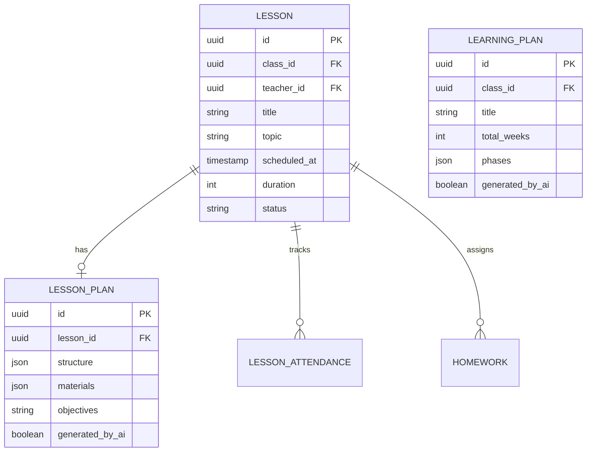

### 1.5 Homework & Quizzes

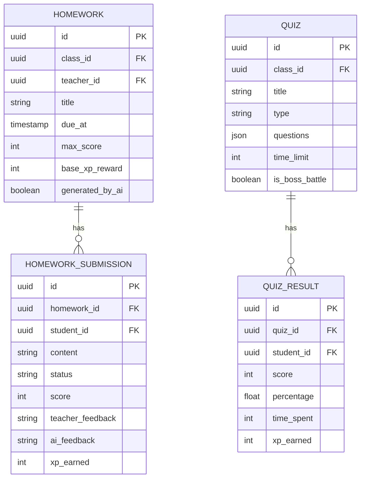

### 1.6 Gamification

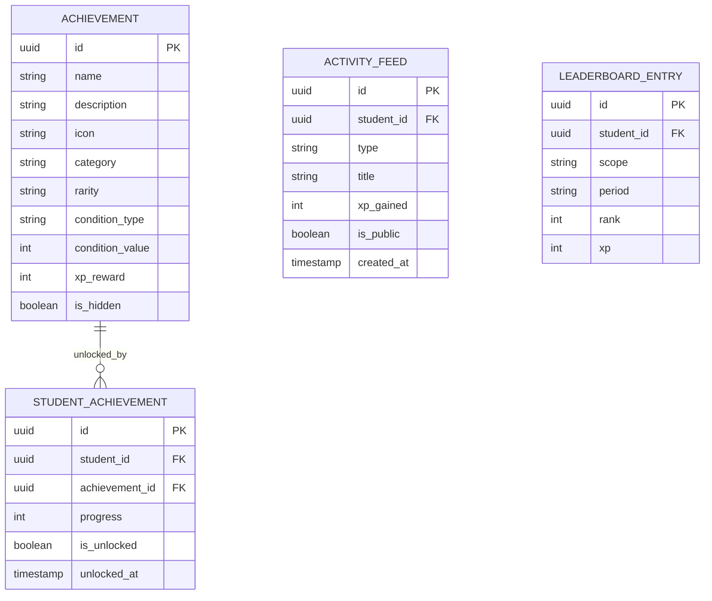

---

## 2. Use Case Diagram

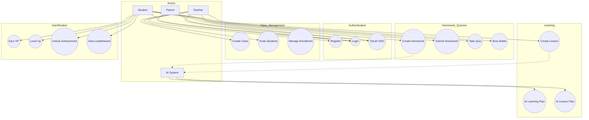

---

## 3. Class Diagram - Core Domain

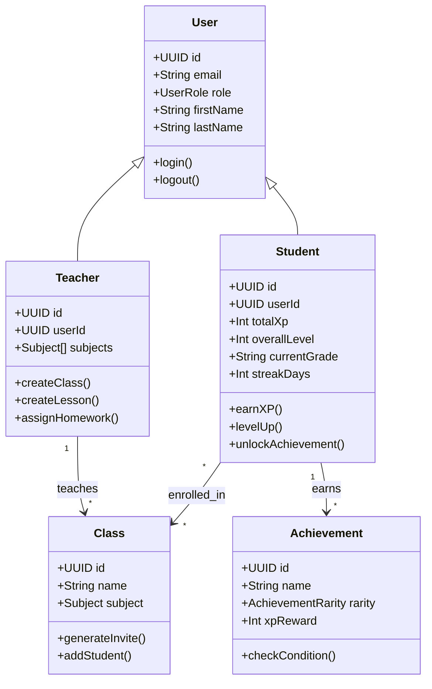

---

## 4. Sequence Diagram - Student Takes Quiz

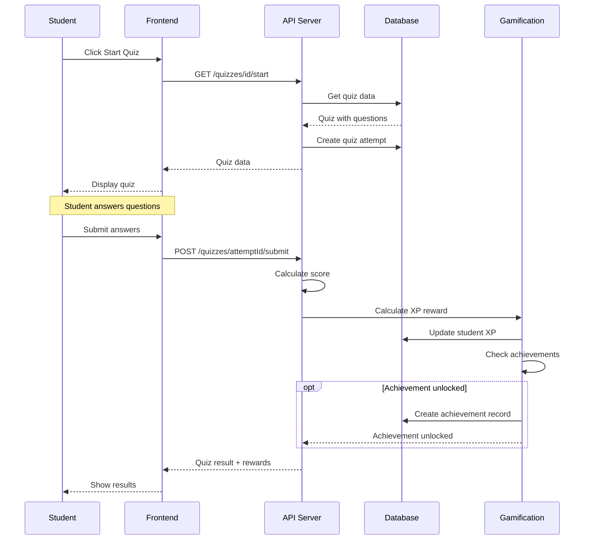

---

## 5. Sequence Diagram - AI Generates Lesson Plan

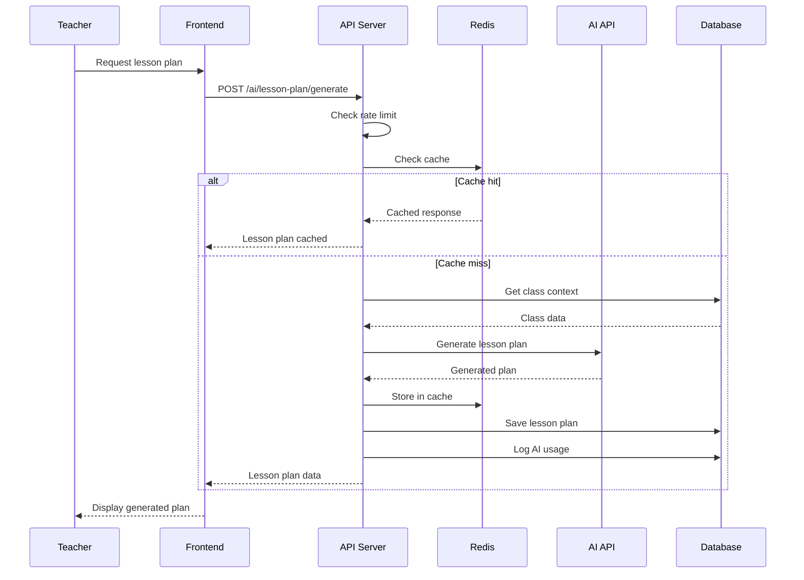

---

## 6. Sequence Diagram - Student Onboarding

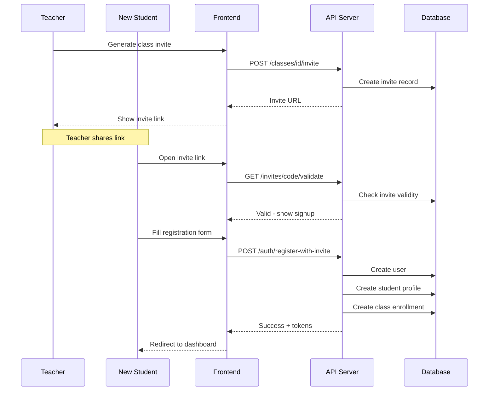

---

## 7. State Diagram - Homework Lifecycle

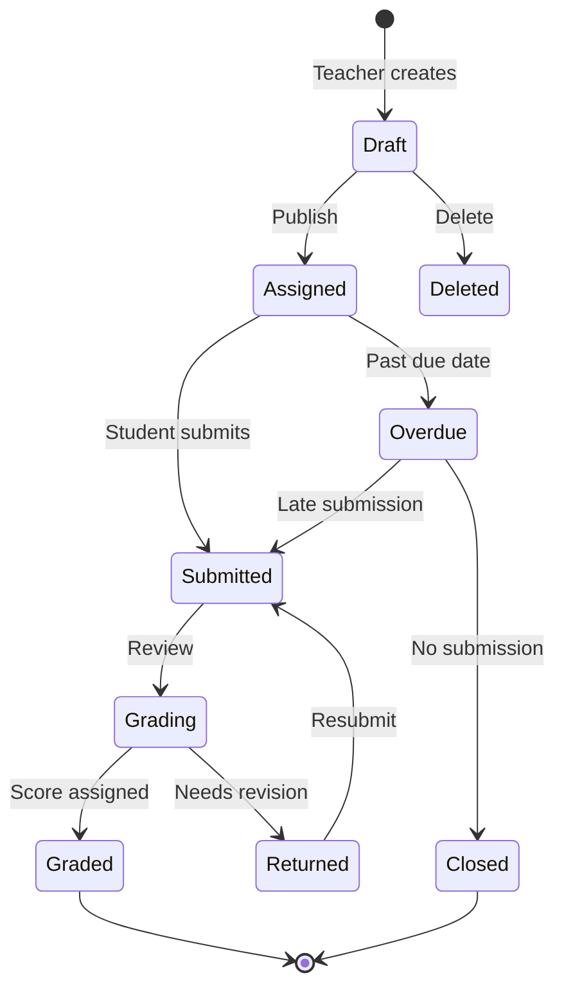

---

## 8. State Diagram - Level Progression

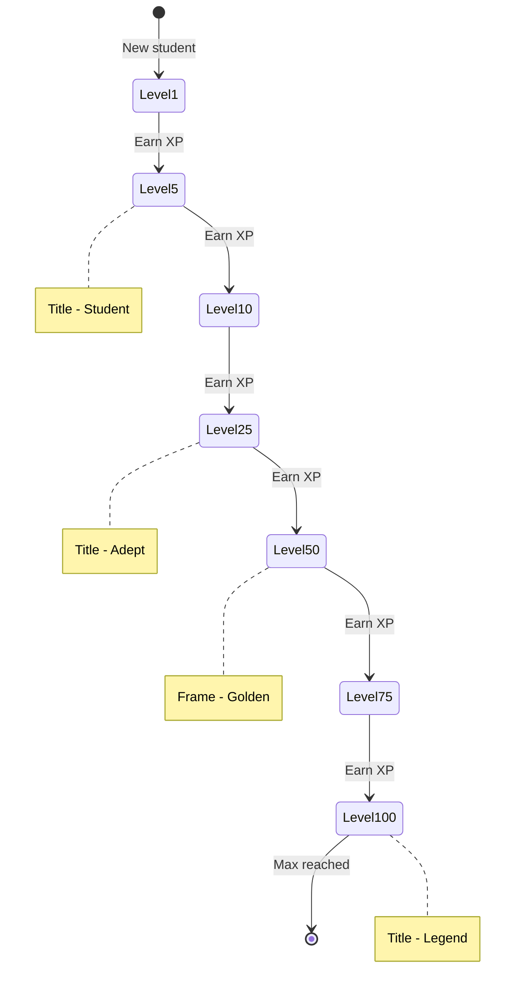

---

## 9. Component Diagram

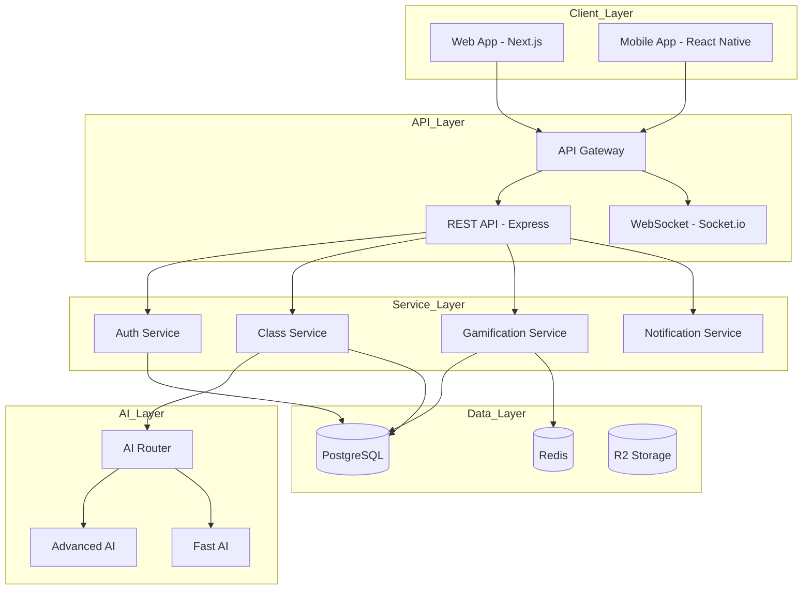

---

## 10. Deployment Diagram

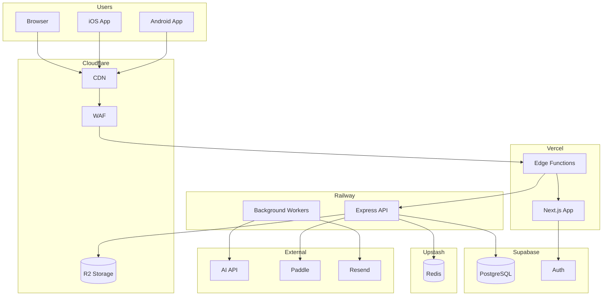

---

## Quick Reference - Mermaid Syntax

### ERD Relationships
```
||--|| : One to One
||--o{ : One to Many  
}o--o{ : Many to Many
```

### Common Issues
1. Avoid comments with double percent signs in some renderers
2. Keep diagrams small - split large ones into sections
3. Avoid special characters in labels
4. Use underscore instead of spaces in identifiers

---

**End of UML Diagrams**
